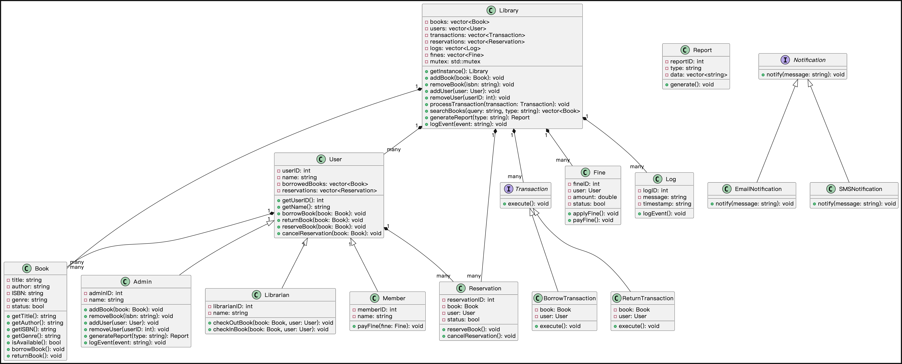

# Library Management System (C++)

## Project Description

### Features

- **User Management**: Supports different user roles such as admins, librarians, and members with specific privileges.
  
- **Book Management**: Allows adding, removing, and updating book information in the library catalog.

- **Transaction Processing**: Handles borrowing and returning books by members, with fine calculation for overdue returns.

- **Notifications**: Sends notifications to members via email and SMS for transaction updates.

- **Logging**: Logs system events and transactions for auditing and debugging purposes.

- **Reporting**: Generates reports summarizing library activities, book status, and user statistics.

